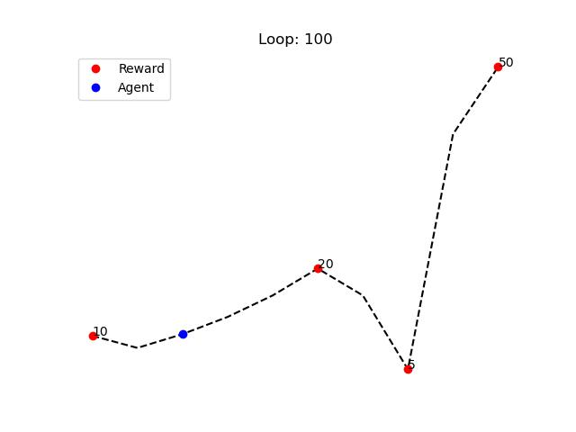

# Reinforcement Learning Agent Uses Q-Learning to Learn an Optimal Policy for Moving Through a 10-State Environment

Reinforcement learning is a type of machine learning in which an agent learns to behave in an environment by trial and error. The agent is given a reward for taking actions that lead to desired outcomes, and a penalty for taking actions that lead to undesired outcomes. Over time, the agent learns to take actions that maximize the reward.

In this example, the agent is a simple object that can move left or right. The environment is a 10-state grid, with each state representing a different location in the grid. The agent's goal is to reach the reward, which is located at 3 places.

The agent learns to move through the environment by using Q-learning. Q-learning is a reinforcement learning algorithm that learns to map states to actions that maximize the expected reward. In this example, the Q-table is a table that stores the expected reward for taking each action in each state.

The agent starts by exploring the environment randomly. As it explores, it learns about the rewards associated with each state and action. Over time, the agent learns to take actions that lead to the reward places, which is the goal of the agent.



The above graph shows Q-Table values after 100 loops.


[video.mp4](./video.mp4)

## Code

```python
import random
import imageio
import matplotlib.pyplot as plt
from rich.progress import track

random.seed(1)

class RL:
    def __init__(self):
        self.q_table = [1]*10
        self.actions = [1, -1]
        self.state = 2
    
    def update_qtable(self, state, nextState):
        if nextState == 0:
            self.q_table[nextState] = 10
        elif nextState == 5:
            self.q_table[nextState] = 20
        elif nextState == 7:
            self.q_table[nextState] = 5
        elif nextState == 9:
            self.q_table[nextState] = 50
        else:
            if self.q_table[state] > self.q_table[nextState]:
                self.q_table[nextState] = self.q_table[state] * 0.8
        self.state = nextState
    
    def nextState(self, explore):
        if self.state == 0:
            next_state = 1
        elif self.state == 9:
            next_state = 8
        else:
            if random.random() < explore:
                next_state = self.state + random.choice(self.actions)
            else:
                if self.q_table[self.state + 1] > self.q_table[self.state - 1]:
                    next_state = self.state + 1
                else:
                    next_state = self.state - 1
        return next_state

rl = RL()
writer = imageio.get_writer('video.mp4', fps=5)

for i in track(range(100)):
    rl.update_qtable(rl.state, rl.nextState(1))

    plt.plot(rl.q_table, '--', color='black')
    plt.plot([0, 5, 7, 9], [rl.q_table[0], rl.q_table[5], rl.q_table[7], rl.q_table[9]], 'ro', label='Reward')
    plt.plot(rl.state, rl.q_table[rl.state], 'o', color='blue', label='Agent')
    plt.text(0, rl.q_table[0], s='10')
    plt.text(5, rl.q_table[5], s='20')
    plt.text(7, rl.q_table[7], s='5')
    plt.text(9, rl.q_table[9], s='50')
    plt.legend()
    plt.axis('off')

    plt.title(f'Loop: {i+1}')
    plt.savefig('graph.jpg')
    plt.close()

    img = imageio.imread('graph.jpg')
    writer.append_data(img)

writer.close()
```