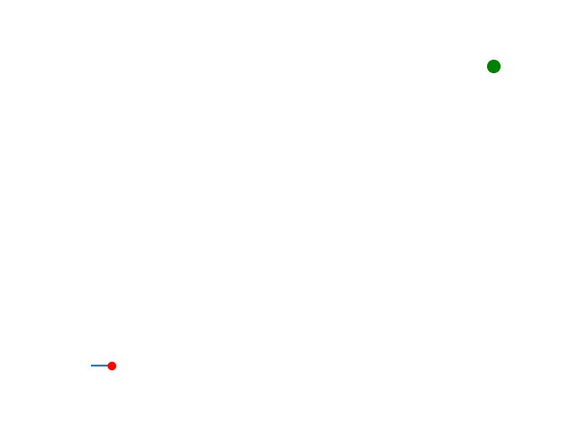

# Reinforcement

```python
while True:
    random_choice = random.choice(d)
    if random_choice != [-i for i in pre] and \
    -5 <= a[0]+random_choice[0] <= 5 and -5 <= a[1]+random_choice[1] <= 5:
        pre = random_choice
        break
```


```python
c = np.argmin([(a[0]+i[0]-destination[0])**2 + (a[1]+i[1]-destination[1])**2 for i in d])
print(c)
a[0] += d[c][0]
a[1] += d[c][1]
```

