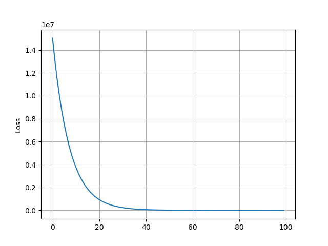

# Gradient Descent
Let us take
- Matrix $X$ of shape $10$ X $1$
- Matrix $W$ of shape $1$ X $10$
- $B$ is a number
- Output Matrix $Y=W.X+B$ ..........(1)

Let us take Matrix $w$ contains random elements and random number $b$.

Now, we are going to use **Gradient Descent** to find $w$ and $b$ that satisfied equation no. (1).
## Code
Importing packages
```python
import numpy as np
import matplotlib.pyplot as plt
```
Initializing values
```python
np.random.seed(0)

X = np.random.randint(0, 101, (10, 1))
W = np.random.randint(0, 101, (1, 10))
B = np.random.randint(0, 101)
Y = W @ X + B
```
Let us take Matrix $w$ contains random elements and random number $b$.
```python
w = np.random.randint(0, 101, (1, 10))
b = np.random.randint(0, 101)
```
**Loss function:**

$loss={1 \over N}{\sum (Y - w.X - b)^2}$
```python
loss = ((Y - w @ X - b)**2).mean()
```
**Gradient:**

${\partial (loss) \over \partial w}=-2X^T(Y-w.X-b)$

${\partial (loss) \over \partial b}=-2(Y-w.X-b)$
```python
def dw(X, Y, w, b):
    return -2*X.T*(Y - w @ X - b)

def db(X, Y, w, b):
    return -2*(Y - w @ X - b)
```
for loop
```python
lr = 1e-6
d = []
for i in range(100):
    w = w - lr*dw(X, Y, w, b)
    b = b - lr*db(X, Y, w, b)

    loss = ((Y - w @ X - b)**2).mean()

    d.append(loss)
print(W @ X + B, w @ X + b, sep='\n')
```
Loss graph
```python
plt.plot(d)
plt.grid()
plt.ylabel('Loss')
plt.savefig('loss.svg')
plt.close()
```
**Graph:**



---
